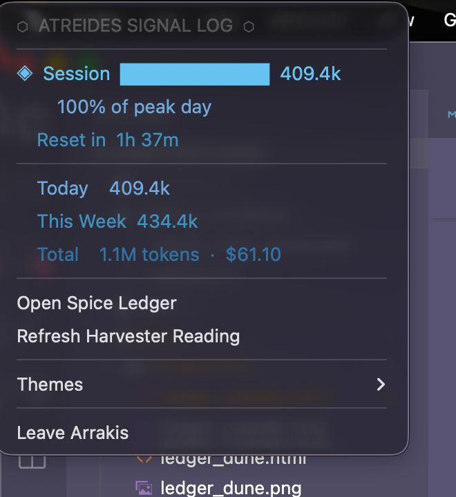
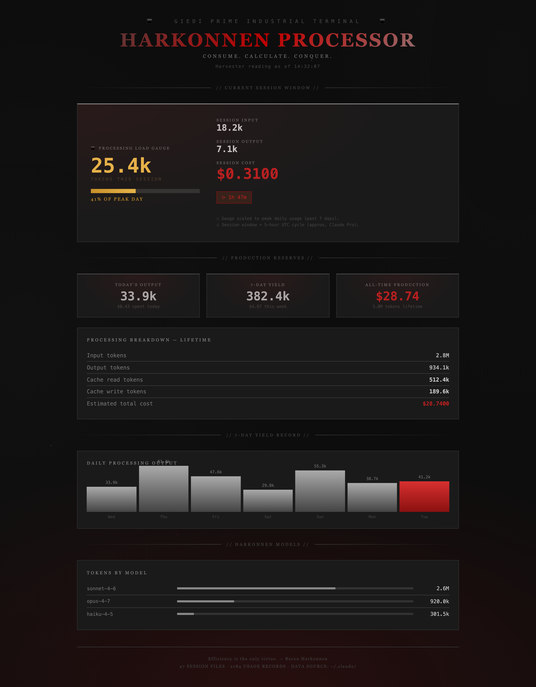

# 🏜 Claude Spice Harvester
### *A Dune-inspired macOS menu bar app for Claude Code token usage*

> "The spice must flow." — Dune

---

## Screenshots

| Menu Bar | Spice Ledger |
|---|---|
|  |  |

---

## What it does

Claude Spice Harvester sits in your macOS menu bar and shows your Claude Code token usage at a glance. Click **Open Spice Ledger** for a full themed dashboard with session gauge, charts, and per-model breakdowns.

**Menu bar shows:**
- Session token count + time until reset
- Colored stats per time window (session · today · this week · all-time)

**Dashboard shows:**
- Session gauge (scaled to your peak daily usage)
- Today's and this week's token totals and cost
- 7-day bar chart ("Harvesting Record")
- Per-model token breakdown
- All-time totals and estimated cost

---

## Prerequisites

| Requirement | Notes |
|---|---|
| macOS 12 or later | Menu bar apps require macOS |
| Python 3.9+ | Check with `python3 --version` |
| [Claude Code](https://claude.ai/code) installed and used at least once | The app reads from `~/.claude/` — nothing to show until Claude Code has run |
| `rumps` | `pip3 install rumps` |
| `pyobjc` | Needed for menu color support; usually pre-installed on macOS. Install with `pip3 install pyobjc` if colors are missing. |

---

## Quick Start

```bash
# 1. Install the one dependency
pip3 install rumps

# 2. Run it
python3 claude_spice_harvester.py
```

`🏜` appears in your menu bar immediately. No account, no API key, no network calls — it reads directly from `~/.claude/`.

---

## Themes

Switch themes from the **Themes** submenu in the menu bar. The selected theme persists between sessions.

### Arrakis (Dune)
| Menu Bar | Spice Ledger |
|---|---|
|  |  |

### Caladan
| Menu Bar | Spice Ledger |
|---|---|
|  |  |

### Giedi Prime
| Menu Bar | Spice Ledger |
|---|---|
|  |  |

---

## Build a standalone .app

```bash
chmod +x build_app.sh
./build_app.sh
```

Produces `ClaudeSpiceHarvester.app`. Drag to `/Applications` and double-click.

**First launch:** macOS Gatekeeper will warn about an unidentified developer. Fix it once:
> Right-click `ClaudeSpiceHarvester.app` → **Open** → **Open**

---

## How it reads your data

Spice Harvester scans `~/.claude/projects/**/*.jsonl` for Claude Code's JSONL session files and totals token usage locally. No data leaves your machine.

**Session window:** Claude Pro resets every 5 hours on UTC boundaries (0h, 5h, 10h, 15h, 20h). The app shows time until the next reset and scales the session gauge against your peak daily usage from the past 7 days.

---

## Customization

Edit `claude_spice_harvester.py` directly:

| What | Where |
|---|---|
| Refresh interval | `300` (seconds) in `ClaudeSpiceHarvesterApp.__init__` |
| Token pricing | `pricing` dict in `estimate_cost()` |
| Menu bar icon | `"🏜"` in `ClaudeSpiceHarvesterApp.__init__` |

---

## Troubleshooting

| Symptom | Fix |
|---|---|
| "No spice yet" | Claude Code hasn't been used yet, or `~/.claude/` doesn't exist |
| $0.00 cost | Cost is estimated from approximate model pricing; actual bills may differ |
| App won't open | Right-click → Open (Gatekeeper, one time only) |
| Menu bar text cut off | macOS quirk on smaller screens — normal behavior |

---

## Why is the usage data different from Claude Code's usage settings?

The numbers shown by Spice Harvester will rarely match what you see at **claude.ai → Settings → Usage**. There are several reasons:

**Different data sources.**
Spice Harvester reads local JSONL files from `~/.claude/` on this machine only. The Claude settings page pulls from Anthropic's servers, which have the authoritative record across all your devices and sessions. If you've used Claude Code on multiple machines, or used Claude via the web or mobile apps, that usage won't appear in the local files.

**Cost is estimated, not real.**
The app uses hardcoded API pricing (e.g. Sonnet at $3/$15 per million tokens) to estimate cost. Claude Code subscribers on a Pro or Max plan don't pay per-token — they pay a flat subscription, and Anthropic tracks usage against plan limits on the server side. The settings page reflects that server-side accounting, not a per-token dollar figure.

**Local files may be incomplete.**
Claude Code writes session data locally, but not every token exchange is guaranteed to be flushed to disk (e.g. after a crash or force-quit). Some records may also be in a format the app doesn't recognise and are silently skipped.

**The session window is approximated.**
The app approximates Claude Pro's reset cycle as a fixed 5-hour UTC boundary (0h, 5h, 10h, 15h, 20h). Anthropic's actual limit logic may use a different window or rolling calculation that isn't exposed locally.

**Pricing rates may be stale.**
The rates in `estimate_cost()` reflect pricing at the time the code was written. Anthropic adjusts pricing over time, so some usage records may be costed at outdated rates.

> **Note:** There is no public API for the data shown on the Claude settings page. Anthropic's Usage & Cost Admin API requires an organization account — it is not available to individual Pro or Max subscribers. The local JSONL approach is the only viable option for a personal tool like this.

---


*Reads from `~/.claude/` · No network calls · Data stays local*  
*Built with `rumps` · Dune theme inspired by Frank Herbert*
