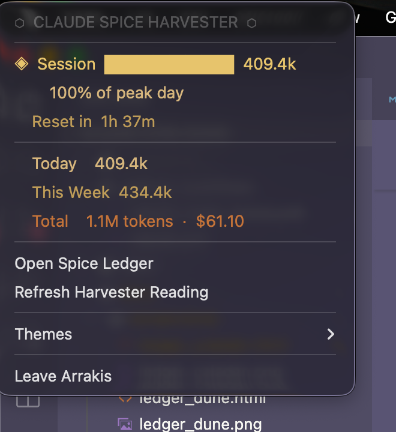
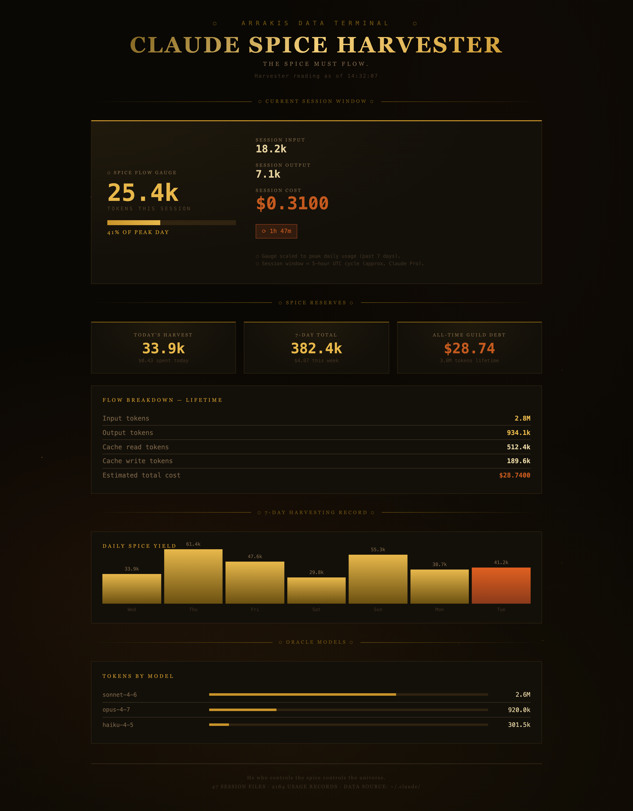
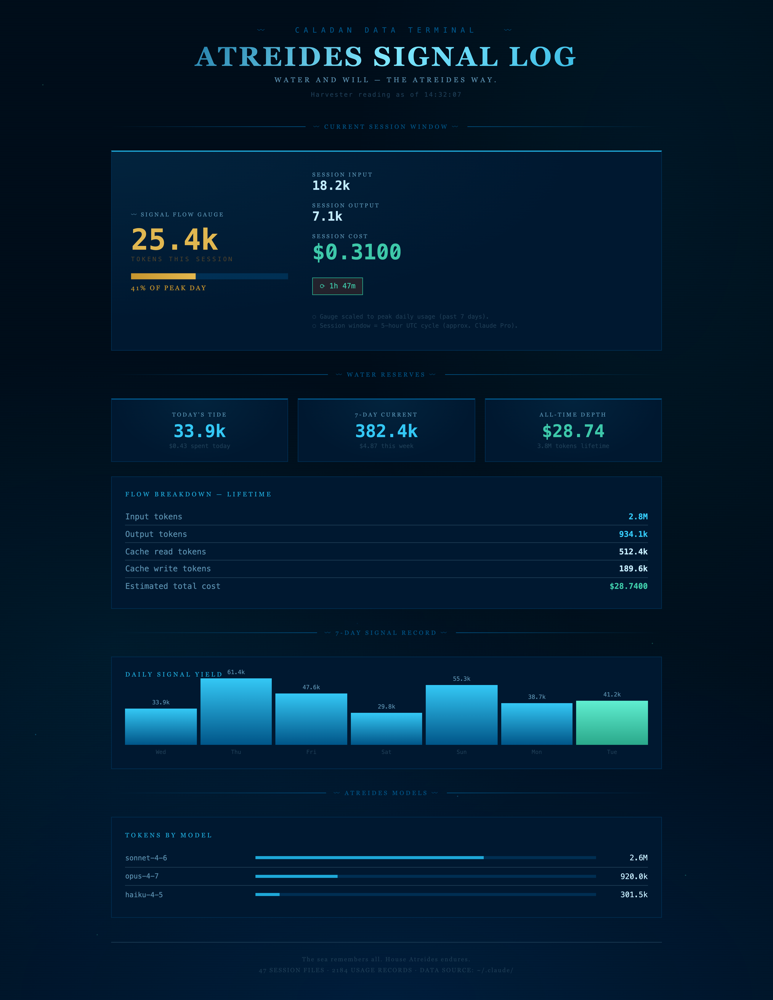
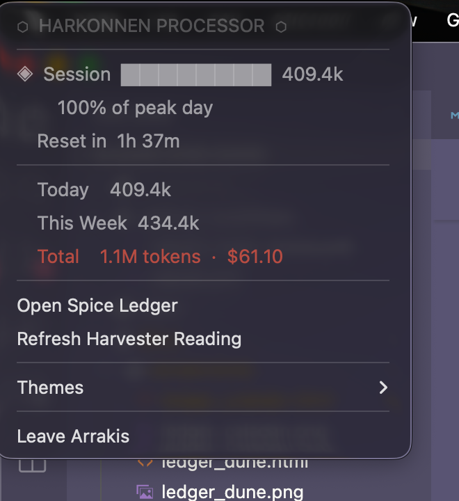

# 🏜 Claude Spice Harvester
### *A Dune-inspired macOS menu bar app for Claude Code usage*

> "The spice must flow." — Dune

---

## Themes

### Arrakis
| Menu Bar | Spice Ledger |
|----------|-------------|
|  |  |

### Caladan
| Menu Bar | Spice Ledger |
|----------|-------------|
|  |  |

### Giedi Prime
| Menu Bar | Spice Ledger |
|----------|-------------|
|  |  |

---

## What it does

Claude Spice Harvester sits in your macOS menu bar and shows your Claude Code token usage at a glance. Click **Open Spice Ledger** for a full Dune-themed dashboard with charts and breakdowns.

**Menu bar shows:**
```
🏜 12.4k today · $3.21 total
```

**Dashboard shows:**
- All-time tokens + estimated cost
- Today's and this week's usage
- 7-day bar chart ("Harvesting Record")
- Per-model breakdown

---

## Quick Start (run directly, no packaging)

```bash
# 1. Install the one dependency
pip3 install rumps

# 2. Run it
python3 claude_spice_harvester.py
```

You'll see `🏜` appear in your menu bar immediately.

---

## Build a standalone .app (shareable, no Python needed)

```bash
chmod +x build_app.sh
./build_app.sh
```

This produces `ClaudeSpiceHarvester.app`. Drag it to `/Applications` and double-click.

**First launch warning:** macOS Gatekeeper will say it's from an "unidentified developer" because the app isn't signed with a paid Apple Developer certificate. Fix it once:
> Right-click `ClaudeSpiceHarvester.app` → **Open** → **Open**

After that, it launches normally forever.

---

## How it reads your data

Claude Spice Harvester scans `~/.claude/` for Claude Code's JSONL session files. Each file contains conversation history with token usage in every assistant response. The app totals these up locally — no network calls, no data leaves your machine.

**Data sources checked (in order):**
1. `~/.claude/projects/**/*.jsonl`
2. `~/.claude/sessions/**/*.jsonl`
3. `~/.claude/**/*.jsonl` (catch-all)
4. `~/.claude/usage.json` (if present)

---

## Troubleshooting

| Symptom | Fix |
|---|---|
| "No spice yet" in menu bar | Claude Code hasn't been used yet, or `~/.claude/` doesn't exist |
| $0.00 cost shown | Cost estimation uses approximate model pricing; your actual cost may differ |
| App won't open on macOS | Right-click → Open (see Gatekeeper note above) |
| Menu bar text is cut off | This is a macOS quirk with long menu bar titles on smaller screens |

---

## Customization

Open `claude_spice_harvester.py` in any text editor to tweak:

- **Refresh interval** — change `300` (seconds) in `ClaudeSpiceHarvesterApp.__init__`
- **Token pricing** — update the `pricing` dict in `estimate_cost()`
- **Dashboard colors** — edit the CSS variables at the top of `HTML_TEMPLATE`
- **Menu bar icon** — change `"🏜"` in `ClaudeSpiceHarvesterApp.__init__`

---

*Built with `rumps` · Dune theme inspired by Frank Herbert · Data stays local*
